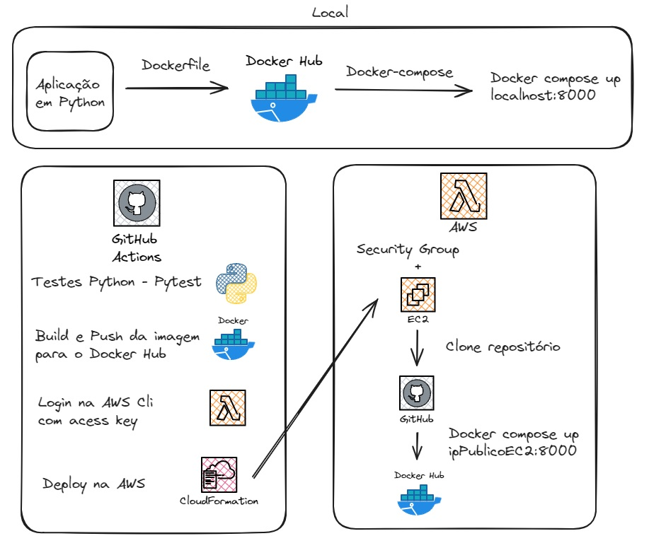

# Bem vindos ao Ada Hack - Devops

Este é um evento de Hackathon da Ada Tech.

# Equipe DO3
- Andrea Gonçalves
- Christopher Mickelle
- Leonardo Vasconcelos Santana
- Ng Lai Koin
- Vitor Santos de Oliveira

## Objetivo

O objetivo principal deste Hackathon é criar estratégias e desenvolver soluções inovadoras que ajudem a Corp Solutions a aumentar a diversidade e a inclusão em sua equipe. Os participantes deverão criar soluções que promovam uma cultura organizacional mais diversificada e inclusiva, utilizando tecnologia e criatividade para enfrentar esse desafio. O hackathon visa encontrar ideias e projetos que possam ser implementados dentro de ambientes corporativos para impulsionar a diversidade e a inclusão no ambiente de trabalho, contribuindo para o crescimento dessa causa dentro do mercado de trabalho.

## Desafio

Vocês fazem parte de um time de consultoria da corpsolution, que foi alocado em um projeto em um zoológico. Vocês terão acesso a um projeto e o desafio é criar pipelines de CI/CD relacionados ao tema de Diversidade e Inclusão e configurar a infraestrutura necessária para hospedar e escalar a aplicação API em Python. Eles devem garantir a automação dos processos de construção, teste e implantação da aplicação, seguindo as melhores práticas de DevOps.

## API

Foi fornecido a equipe uma API de consulta sobre animais. A documentação completa da API se encontra [aqui](API.md).

## Arquitetura

A arquitetura da infraestrutura implementada:

## Passos para resolução

Para a resolução do case, foi discutido entre a equipe e o orientador os passos a serem seguidos. Mais detalhes encontra-se [aqui](PASSOS.md).

## Acessibilidade e Inclusão
- Documentação clara.
- Desenvolvimento de uma infraestrutura como código.
- Desenvolvimento assíncrono.

## Dificuldades encontradas
- Disponbilidade de conta AWS para testes.
- Gerenciamento das agendas da equipe e das mentorias.

## Sugestões de melhorias
- Utilizar outros serviços da AWS fora do free-tier como: ECS, ECR, Lambda, Fargate.
- Utilizar o Terraform.
- A pilha ser atualizada pelo próprio GitHub: Git-Sync.
- Documentação em inglês.